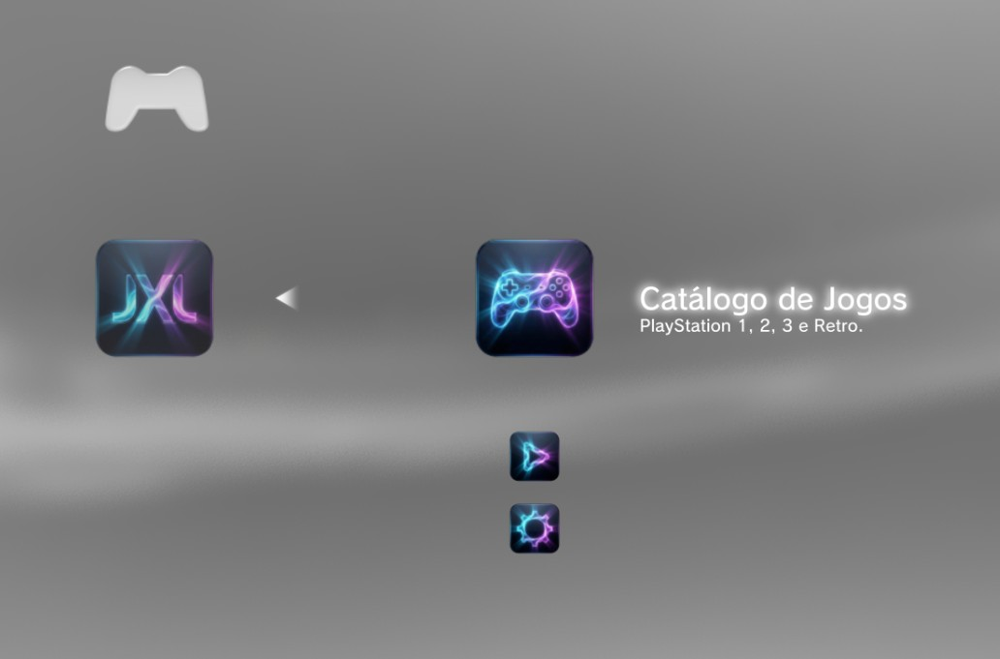

# JXL STORE (Project) 🎮

Uma loja personalizada para PlayStation 3 (HEN/CFW) baseada em XMB (XML nativo).
Focada em ser leve, moderna e eficiente.

 
*(Se você tiver um print da tela, coloque na pasta assets e mude o nome aqui)*

## 🚀 Funcionalidades
- **Interface Nativa:** Roda direto no XMB, sem travamentos.
- **Abas Organizadas:** Jogos e Ferramentas essenciais.
- **Manutenção Avançada:** Ferramentas dedicadas para liberar espaço em disco, gerenciar saves e organizar arquivos do sistema.

## 📦 Instalação Manual (Dev Version)

Este projeto ainda está em desenvolvimento. Para testar:

1. **Copie a pasta:**
   Pegue a pasta `JXL-STORE` (que está dentro de `bin`) e coloque no seu PS3 em:
   `/dev_hdd0/game/`

2. **Edite o XML do Sistema:**
   Vá em `/dev_flash/vsh/resource/explore/XMB/` e edite o arquivo `category_game.xml`.
   Adicione o seguinte código dentro da tag `<Items>`:

   ```xml
   <Item class="type:x-xmb/xmlnps" key="JXL_STORE" attr="JXL_STORE">
       <Pair key="icon"><String>/dev_hdd0/game/JXL-STORE/ICON0.PNG</String></Pair>
       <Pair key="title"><String>JXL STORE</String></Pair>
       <Pair key="src"><String>xmb://localhost/dev_hdd0/game/JXL-STORE/USRDIR/xml/jxl-xmb.xml#jxl_root_entry</String></Pair>
   </Item>```

3. **Reinicie o Console:**
    Dê um Soft Reboot ou reinicie o PS3. O ícone aparecerá na coluna JOGOS.

---

## 📞 Contato & Suporte

Gostou do projeto? Tem dúvidas? Me siga no Instagram:

[

**Desenvolvido por T I T O (JXL Project) © 2025**